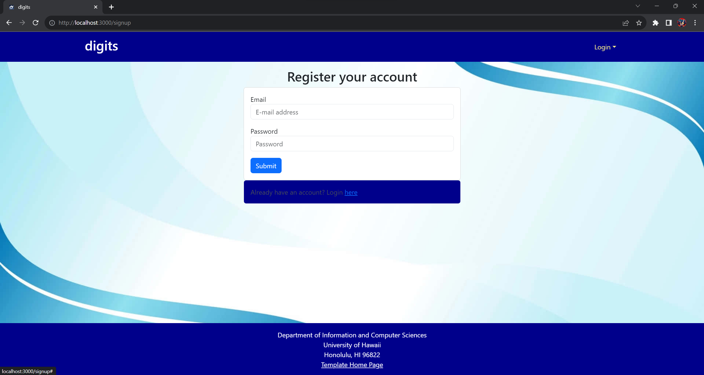
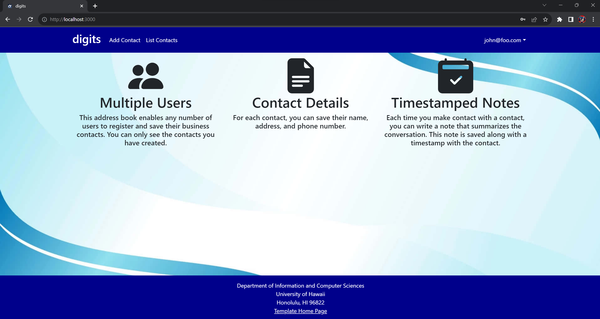
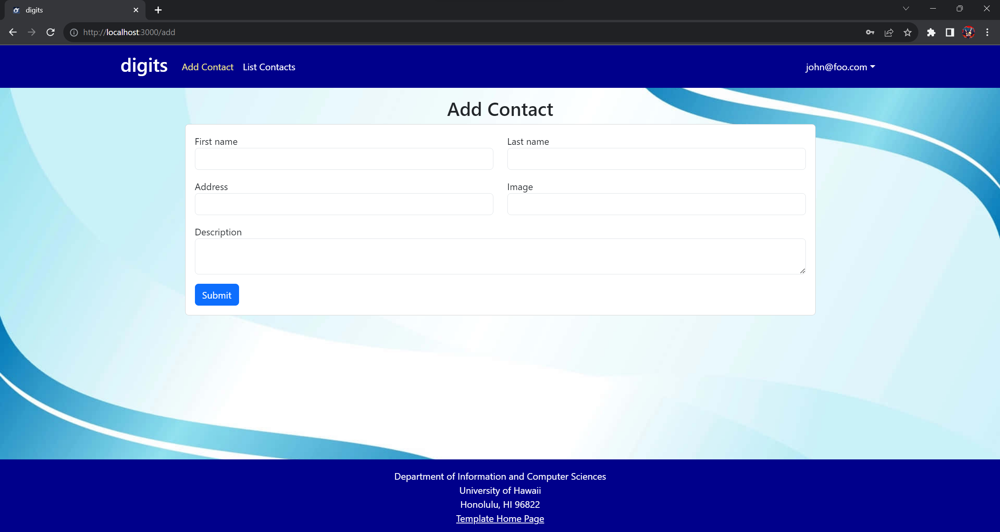
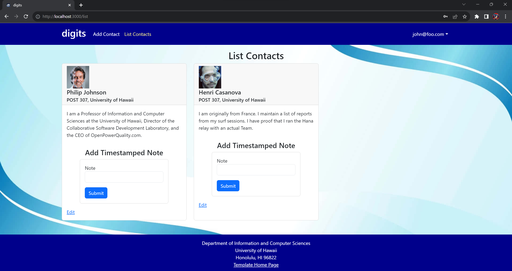
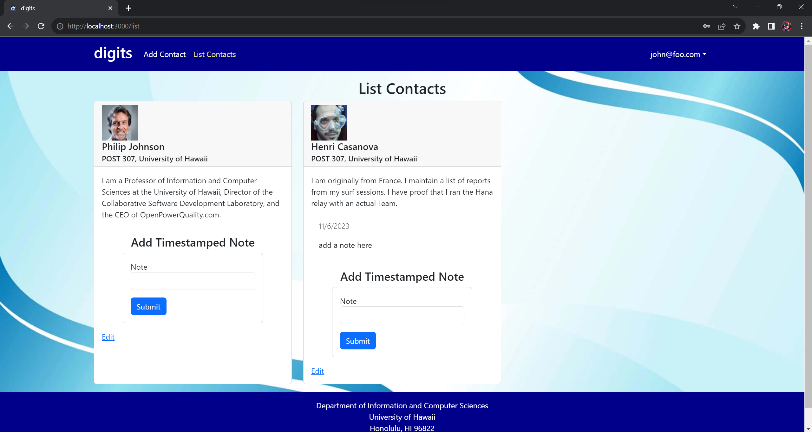
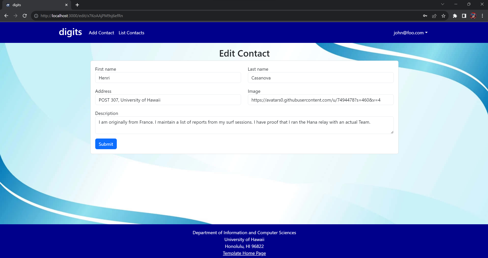
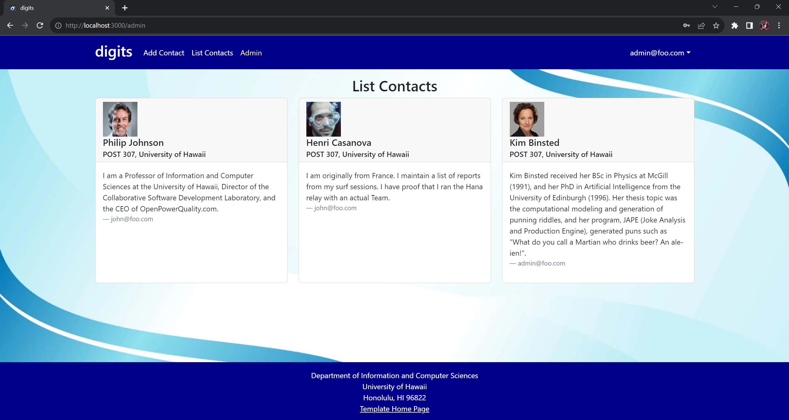

  <h1>ICS 314 Digits Project</h1>
  

#### Digits Project

To install this project locally:

  * Clone this project to whatever directory you prefer.
  * Open a terminal window and cd into the app directory of this project.
  * Type "meteor npm install" and hit enter.

To run this project:

  * Open a terminal window and cd into the app directory of this project.
  * Type "meteor npm run start" and hit enter.
  * Type "http://localhost:3000" into any browser.

From the page above, you can either choose to create a new account, or to log into an existing account. This will take you to one of the following two pages:

#### Signup & Sign-in Pages 

  
  

One of the default accounts has the email "john@foo.com", and the password "changeme".

Once signed in, you'll be taken to this page:

#### Landing Page

  

This page is the same as the original landing page, but it lets you navigate to the pages to add and list contacts that are associated with your account.

At this point, you can access either of these two pages from the navbar:

#### Add Contact & List Contacts

  
  

From the Add Contacts page, you can add contacts freely, which only you will be able to see. You can also view all of your contacts on the List Contacts page. When viewing contacts, you will be able to add Timestamped Notes, and the date at which you left the note will be automatically recorded.

Here you can see a note I added:

  

From the List Contacts page, you can choose to edit contacts.

#### Edit Contact

  

Here you can edit a contact, and navigate back to the List Contacts page with the navbar to view your updated contact.

If you log in as an admin, you'll see a different landing page. The default email is "admin@foo.com" and password is "changeme".

#### Landing Page, Admin User

  

You can then navigate to the Admin page in the navbar.

#### Admin

  

From here you can see every contact, as well as who owns each.